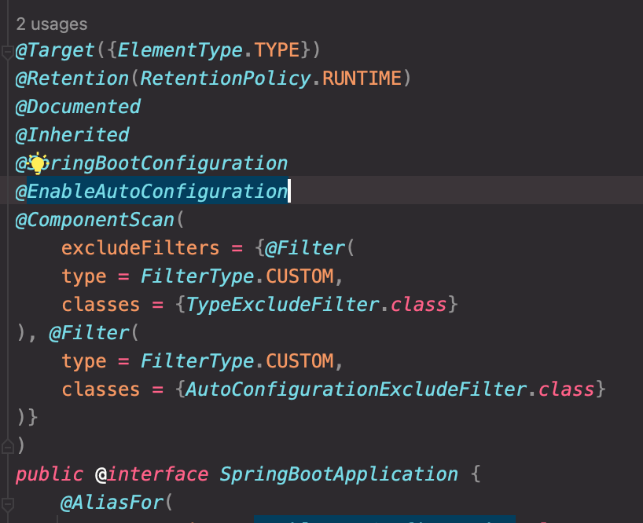

### Upgrading from 1.x
- 새로운 릴리즈 버전으로 업그레이드 하면 속성값들이 이름이 변경되거나 삭제되기도 하는데, 구 버전 스프링 부트에서 새로운 릴리즈 버전으로 마이그레이션 시에 변경 사항을 감지하고 안내해주는 라이브러리 제공함.
```xml
<dependency>
    <groupId>org.springframework.boot</groupId>
    <artifactId>spring-boot-properties-migrator</artifactId>
    <scope>runtime</scope>
</dependency>
```
- 마이그레이션이 끝나면 의존성 제거해야 한다.

### 스프링 부트 릴리트 노트 링크
- [link](https://github.com/spring-projects/spring-boot/wiki#release-notes)

### 6. 스프링 부트로 개발하기
- 의존성 관리를 지원하는 빌드 시스템을 선택할 것을 권장함. 특히 maven, gradle

### Dependency management
- 각 릴리즈 버전에서 스프링 부트가 디펜던시 버전도 관리해주기 때문에 디펜던시 버전을 일일이 명시하지 않아도 된다. 
- Starters
  - starters는 부트 프로젝트 구성과 실행에 필요한 디펜던시들을 포함한다. 필요한 디펜던시를 'spring-boot-starter-*' 한 줄만 명시하면 알아서 임포트 해준다. 
  - 기존의 요소들을 제외하거나 갈아 끼우기도 가능하다.

### Structuring Your Code
- 클래스가 선언된 패키지에 존재하지 않으면, 부트는 'default package' 에 존재할 것으로 간주한다. 그러나 기본 패키지는 사용하지 않는게 좋다.  
- 기본 패키지를 사용하면 @ComponentScan, @ConfigurationPropertiesScan, @EntityScan, or @SpringBootApplication 어노테이션들을 사용할 때 특히 문제가 될 수 있다. 
### Main Application Class 의 위치

|                                                            |                                                                                                                                                                                                                                                                                                                                |
|------------------------------------------------------------|--------------------------------------------------------------------------------------------------------------------------------------------------------------------------------------------------------------------------------------------------------------------------------------------------------------------------------|
|  | 일반적으로 Main Application 클래스는 루트 패키지 경로에 위치해야 한다. <br/> 이 패키지가 요소들 검색의 시작점이 되기 때문이다. <br/> 예를 들면, JPA 어플리케이션에서는, <br/> ```@SpringBootApplication``` 어노테이션이 선언된 클래스의 패키지를 기점으로 <br/> ```@Entity``` 아이템들을 검색한다. <br/> 다른 패키지를 기점으로 아이템 검색을 원한다면 <br/> ```@EnableAutoConfiguration``` 과 ```@ComponentScan```  <br/> 어노테이션을 사용하면 된다. |
  
### Configuration Classes
- 스프링 부트는 자바로 된 설정 구성을 선호한다. 물론 XML 로 환경 설정이 가능하지만 ```@Configuraion``` 클래스에 구성하는 것을 추천한다.  
  보통은 메인 메서드가 @Configuration 을 선언하기에 좋은 타겟이다.
#
- Importing Additional Configuration Classes  
  [link](https://www.baeldung.com/spring-import-annotation)
- Xml 설정 임포트  
  ```@ImportResource``` 사용
- Auto-configuration
  jar 디펜던시를 기준으로 개발자가 설정 관련 빈 클래스를 정의하지 않아도 부트가 알아서 구성한다.
  ```@EnableAutoConfiguration``` 이나 ```@SpringBootApplication``` 어노테이션을 선언해주면 된다.

### Spring Beans and Dependency Injection
- ```@SpringBootApplication```이 선언된 클래스가 루트 패키지에 위치해 있다면, 이 경로를 기준으로 빈 클래스(@Component, @Service, @Repository, @Controller 등)을 탐색해 의존성 주입을 해준다.
  생성자를 통한 주입을 사용했을 경우, 생성자가 2개 이상이면 ```@Autowired```를 선언 해줘야 한다. 

### Using the @SpringBootApplication Annotation


- @EnableAutoConfiguration : 스프링 부트 auto-configuration 매커니즘을 활성화 한다.
- @ComponentScan : @Component 스캔을 활성화 한다. 
- @SpringBootConfiguration : 추가적인 빈, 설정 클래스들을 등록과 임포트를 해준다.

```java
// Same as @SpringBootConfiguration @EnableAutoConfiguration @ComponentScan
@SpringBootApplication
public class MyApplication {

    public static void main(String[] args) {
        SpringApplication.run(MyApplication.class, args);
    }

}
```